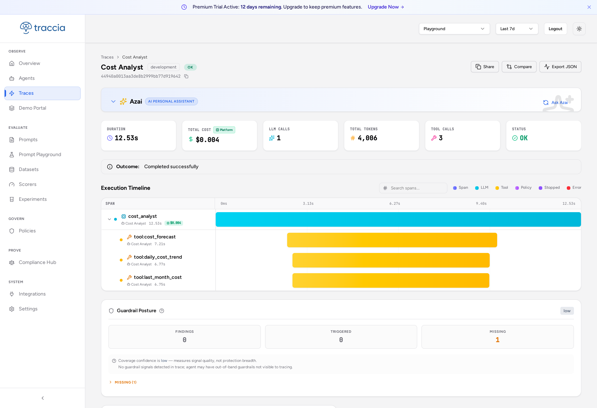
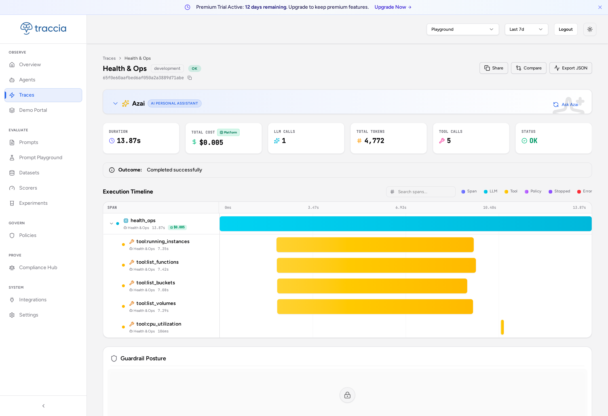
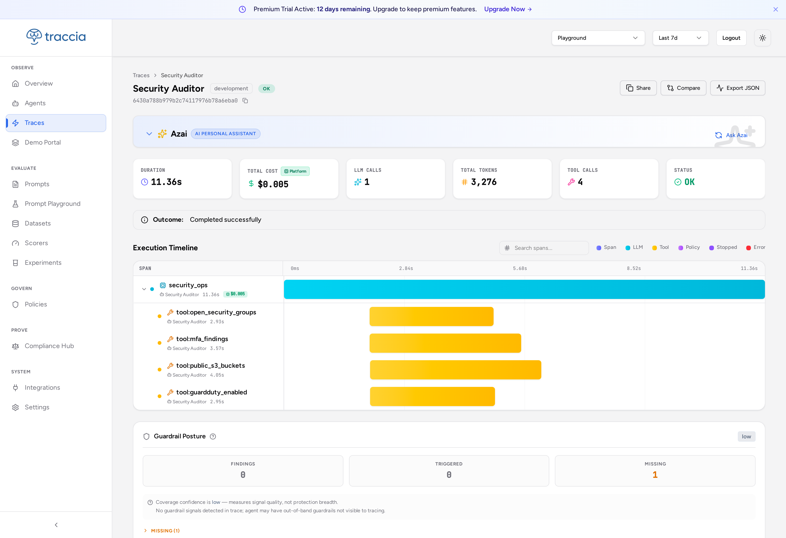
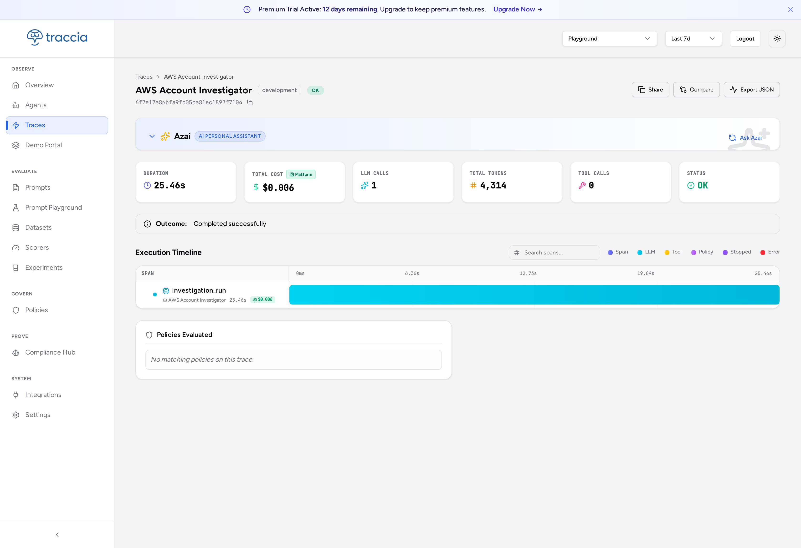
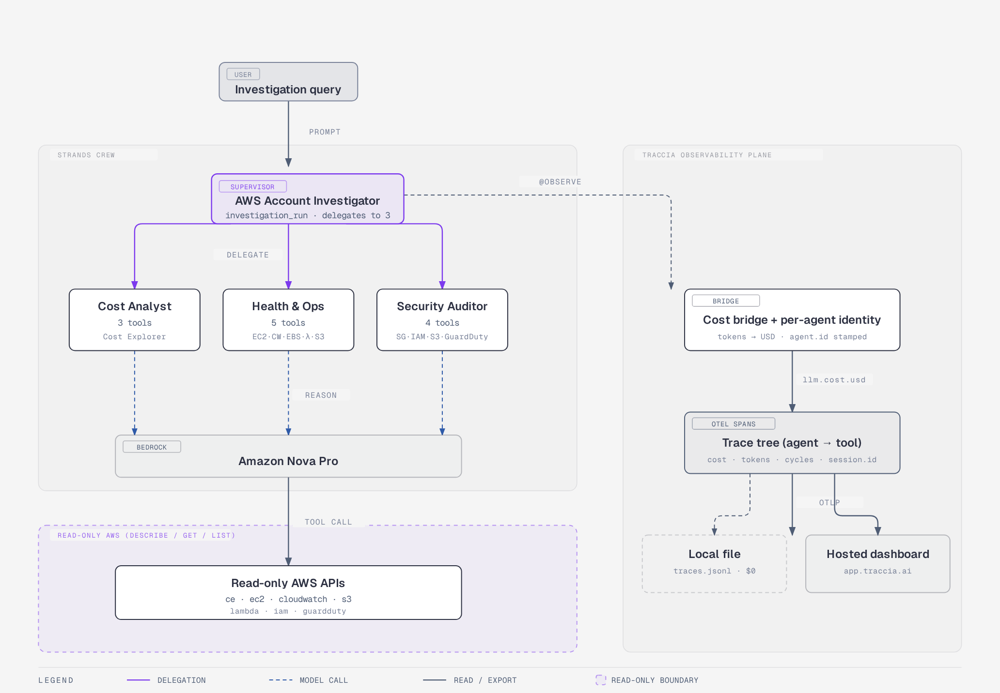

<div align="center">

# 🔍 AI Agent Observability on AWS: Catch the Silent Waste (2026)

### Build a read-only multi-agent crew on Amazon Bedrock, put real per-agent cost on every trace, then reproduce three "silent waste" patterns that return a perfect answer, show `200 OK`, and still bill you 1.5x.

[](https://traccia.ai)
[](https://aws.amazon.com/bedrock/)
[](https://strandsagents.com)
[](https://aws.amazon.com/ai/generative-ai/nova/)
[](https://opentelemetry.io)
[](LICENSE)

[](https://github.com/simplynadaf/ai-agent-observability-aws/stargazers)
[](https://github.com/simplynadaf/ai-agent-observability-aws/network/members)
[](https://github.com/simplynadaf/ai-agent-observability-aws/issues)

---

**⭐ If this helped you see where your agents burn money, give it a star! It helps others find it.**

[The Problem](#-the-problem) • [The Crew](#-the-crew-4-read-only-agents) • [Silent Waste](#-the-three-silent-waste-scenarios) • [Getting Started](#-getting-started) • [Before vs After](#-before-vs-after) • [FAQ](#-faq)

</div>

<details>
<summary><b>📖 Table of Contents</b></summary>

- [The Problem](#-the-problem)
- [The Crew (4 read-only agents)](#-the-crew-4-read-only-agents)
- [How It Works](#-how-it-works)
- [The Three Silent-Waste Scenarios](#-the-three-silent-waste-scenarios)
- [Tech Stack](#-tech-stack)
- [Prerequisites](#-prerequisites)
- [Getting Started](#-getting-started)
- [Before vs After](#-before-vs-after)
- [Example: same answer, different bill](#-example-same-answer-different-bill)
- [Project Structure](#-project-structure)
- [The Cost Bridge (and one gotcha)](#-the-cost-bridge-and-one-gotcha)
- [Least-Privilege IAM Policy](#-least-privilege-iam-policy)
- [An Honest Take on Traccia](#-an-honest-take-on-traccia)
- [Customization](#-customization)
- [Troubleshooting](#-troubleshooting)
- [FAQ](#-faq)
- [Video Tutorial & Article](#-video-tutorial--article)
- [Contributing](#-contributing)
- [License](#-license)

</details>

---

## 🤔 The Problem

Your multi-agent run just returned a **perfect answer**. Clean summary, right resources, no errors. Your APM dashboard says `200 OK`, latency fine, everything green.

And you were silently billed up to **1.5x** what you should have been.

That is the part nobody shows you. Nested traces and per-agent cost are table stakes now. The hard problem is the run that **looks completely successful while it burns money**: re-reading the same data, dragging bloated context step to step, looping one extra cycle. None of it shows up as a `500` or a slow span. It shows up on the bill.

> The research backs this up: **MAST** ([arXiv:2503.13657](https://arxiv.org/abs/2503.13657)) hand-annotated 150 traces across 7 state-of-the-art multi-agent systems and measured a **41-86.7% failure rate**, and many failures do not crash. They complete. They look fine.

**This repo builds a read-only "AWS Account Investigator" crew, wires real cost into every trace span, then reproduces three silent-waste patterns with real Amazon Nova Pro dollars.** Runs at **$0** locally. Nothing is created, modified, or deleted in your AWS account.

---

## 🤖 The Crew (4 read-only agents)

> One supervisor. Three specialists. Every tool is a `describe` / `get` / `list`. Every step is a trace span.

<table>
<tr>
<td width="25%">

### 🧭 Supervisor
**AWS Account Investigator**
- Plans + delegates, then synthesizes one report
- Stamps `agent.delegated_to` + shared `session.id`
- **0** direct AWS calls (delegates only)

</td>
<td width="25%">

### 💰 Cost Analyst
**3 tools · Cost Explorer**
- `cost_forecast`: MTD, month-end forecast, top services
- `last_month_cost`: month-over-month change
- `daily_cost_trend`: daily series + spike day

</td>
<td width="25%">

### 🖥️ Health & Ops
**5 tools · EC2 · CW · EBS · λ · S3**
- `running_instances`, `cpu_utilization`
- `list_volumes`, `list_functions`, `list_buckets`
- Usually the heaviest agent on input tokens

</td>
<td width="25%">

### 🔒 Security Auditor
**4 tools · SG · IAM · S3 · GuardDuty**
- `open_security_groups`, `mfa_findings`
- `public_s3_buckets`, `guardduty_enabled`
- States each finding + risk plainly

</td>
</tr>
</table>

Each specialist stamps its own `agent.id` / `agent.name`, so from a **single crew run** the dashboard shows four distinct agents with their own token and cost profiles, not one agent logged four times. Each tool opens a **live span around the real boto3 call**, so the timeline shows each AWS read's true duration, not a 0ms marker.

### 📸 Tool spans in Traccia (real traces)

Every agent's tools show up as their own spans on the Execution Timeline, each with a real duration. These are real runs against a live AWS account.

<table>
<tr>
<td width="50%" align="center">
<b>💰 Cost Analyst, 3 tool spans</b><br/>

</td>
<td width="50%" align="center">
<b>🖥️ Health &amp; Ops, 5 tool spans</b><br/>

</td>
</tr>
<tr>
<td width="50%" align="center">
<b>🔒 Security Auditor, 4 tool spans</b><br/>

</td>
<td width="50%" align="center">
<b>🧭 AWS Account Investigator, supervisor (0 direct tools, delegates to 3)</b><br/>

</td>
</tr>
</table>

---

## 🧠 How It Works

<div align="center">

</div>

<details>
<summary><b>Text version of the diagram</b></summary>

```
┌──────────────────────────────────────────────────────────────────────────────┐
│                                                                                │
│   🧑 User query          🧭 Strands crew (Nova Pro)        📊 Traccia plane      │
│                                                                                │
│   ┌──────────────┐     ┌──────────────────────────┐    ┌───────────────────┐ │
│   │ investigate  │────▶│ AWS Account Investigator  │───▶│ @observe → spans  │ │
│   │ my account   │     │   delegates to 3          │    │ cost bridge (USD) │ │
│   └──────────────┘     │   ├─ 💰 Cost Analyst  (3) │    │ per-agent identity│ │
│                        │   ├─ 🖥️ Health & Ops  (5) │    └─────────┬─────────┘ │
│                        │   └─ 🔒 Security Aud. (4) │              │           │
│                        └────────────┬─────────────┘              ▼           │
│                                     │              ┌───────────────────────┐ │
│                                     ▼              │ 📁 local file  ($0)    │ │
│                        🔒 READ-ONLY AWS APIs       │ ☁️  app.traccia.ai     │ │
│                        ce · ec2 · cloudwatch · s3  └───────────────────────┘ │
│                        lambda · iam · guardduty                              │
│                        (Describe / Get / List - never create/modify/delete)  │
└──────────────────────────────────────────────────────────────────────────────┘
```

</details>

**Traccia watches the AGENT, not your AWS account.** AWS is just the agent's subject matter. That is why the observability story is stack-agnostic: the same trace structure carries agent-specific attributes (cycle count, tokens, cost, owning agent) that classic APM never needed.

---

## 🔥 The Three Silent-Waste Scenarios

`waste_demo.py` reproduces three patterns deterministically and catches each with a real Strands metric that the Traccia bridge stamps on the span. Detection is **delta-vs-baseline** (how real regression detection works), not brittle magic-number thresholds.

<table>
<tr>
<td width="33%">

### 🔁 Runaway loop
`$0.010694` · **1.3x**
An agent re-reasons / re-reads for the same answer.
**Signal:** `agent.cycle_count` climbs vs baseline.

</td>
<td width="33%">

### 🔂 Redundant tool calls
`$0.008748` · **1.1x**
The same read runs 3x.
**Signal:** `tool.call_count` > 1 for one tool.

</td>
<td width="33%">

### 📦 Context bloat
`$0.012366` · **1.5x**
One agent drags far more context than needed, and it compounds into the supervisor.
**Signal:** `llm.usage.prompt_tokens` + `llm.cost.usd` balloon.

</td>
</tr>
</table>

```bash
python waste_demo.py                       # clean baseline + all 3 waste runs + verdict
python compare.py traces_clean.jsonl traces_bloat.jsonl   # the side-by-side "different bill" view
```

> Every number is **real Nova Pro token usage** and varies run to run. The lesson is the **relationship** (1.5x), not the absolute figure.

---

## 🛠️ Tech Stack

| Component | Technology |
|-----------|-----------|
| 🤖 Agent runtime | [AWS Strands Agents](https://strandsagents.com): agents-as-tools pattern |
| 🧠 Model | [Amazon Nova Pro](https://aws.amazon.com/ai/generative-ai/nova/) (`amazon.nova-pro-v1:0`) via Bedrock |
| 📊 Observability | [Traccia](https://traccia.ai) `0.1.29`: OpenTelemetry-native, `$0` file exporter |
| ☁️ Cloud reads | Cost Explorer · EC2 · CloudWatch · S3 · Lambda · IAM · GuardDuty (read-only) |
| 🐍 SDK | Python 3.10+, `boto3` |
| 🖥️ Live control panel | FastAPI + Server-Sent Events (LIVE + REPLAY modes) |

---

## 📋 Prerequisites

- ✅ **Python 3.10+**
- ✅ **AWS credentials** with the read-only actions in the [IAM policy](#-least-privilege-iam-policy) plus `bedrock:InvokeModel` for Nova Pro (the repo ships the ready-to-use policy at `iam/read-only-policy.json`)
- ✅ **Amazon Nova Pro** (1) enabled in the Bedrock console under *Model access* (`us-east-1`, `amazon.nova-pro-v1:0`) and (2) invokable via `bedrock:InvokeModel` in your policy
- ✅ *(Optional)* a Traccia API key for the hosted dashboard. Leave it unset for the `$0` local path

---

## 🚀 Getting Started

### 1. Clone + install

```bash
git clone https://github.com/simplynadaf/ai-agent-observability-aws.git
cd ai-agent-observability-aws
python3 -m venv .venv && . .venv/bin/activate
pip install -r requirements.txt
```

### 2. Run the crew against real AWS

```bash
python crew.py            # runs the crew, writes traces.jsonl (local, $0)
python view_trace.py      # renders the nested tree + per-agent cost table
```

### 3. Watch the silent waste

```bash
python waste_demo.py      # clean baseline + 3 waste scenarios + delta verdict
```

> 💡 No Traccia account needed. With no `TRACCIA_API_KEY`, traces write to a local file. Set the key and the **same spans** push to [app.traccia.ai](https://app.traccia.ai).

---

## 📊 Before vs After

Same crew, same query, same read-only AWS, different bill. Every item is real, measured token usage.

| Item | 🟢 CLEAN baseline | 🔴 CONTEXT BLOAT |
|------|-------------------|-------------------|
| Final answer | Correct | Correct |
| Crew total cost | **$0.008131** | **$0.012366** |
| Delta | (baseline) | **+$0.004235 (1.5x)** |
| APM status | `200 OK` | `200 OK` |
| Where it shows | nowhere in APM | only in the **trace**, on per-agent cost |

---

## 🎬 Example: same answer, different bill

```
=== CLEAN  vs  BLOAT ===   (same query, same crew, same read-only AWS - different bill)

  agent                          CLEAN                          BLOAT
  health_ops        $0.002463 2279in/200out 3c   $0.004802 2871in/783out 2c  <- 1.9x
  cost_analyst      $0.002578 1515in/427out 2c   $0.002578 1515in/427out 2c
  investigation_run $0.003090 1578in/571out 2c   $0.004985 2183in/1012out 2c <- 1.6x

  CLEAN total  $0.008131
  BLOAT total  $0.012366   (1.5x  +$0.004235)

  Both runs returned a correct-looking answer. APM shows 200 OK for both.
  The trace is the only place the extra $0.004235 is visible.
```

---

## 📁 Project Structure

```
ai-agent-observability-aws/
├── README.md
├── LICENSE                       # Apache-2.0
├── requirements.txt
├── crew.py                       # supervisor + 3 sub-agents, Traccia init, cost bridge
├── tools.py                      # read-only AWS tools (all describe/get/list)
├── waste_demo.py                 # clean baseline + 3 engineered silent-waste scenarios
├── compare.py                    # side-by-side "same answer, different bill" view
├── view_trace.py                 # nested trace tree + per-agent cost table
├── probe_multiagent.py           # token usage at every level
├── probe_doublecount.py          # proves supervisor usage excludes sub-agent tokens
├── agent_config.json             # ownership catalog (owner / team / org) → dashboard
├── build_pages.py                # builds the static docs/ Pages replay from a recorded run
├── iam/
│   └── read-only-policy.json     # ready-to-use least-privilege policy (reads + Nova Pro invoke)
├── ui/                           # FastAPI live control panel (LIVE + REPLAY)
│   ├── app.py                    # /stream SSE backend
│   ├── index.html                # the animated crew graph
│   └── replay/                   # deterministic saved run (free rehearsals)
└── docs/                         # GitHub Pages replay build + README assets
    ├── architecture.png          # the How It Works diagram
    └── screenshots/              # real per-agent Traccia trace captures
```

---

## 🌉 The Cost Bridge (and one gotcha)

Traccia auto-instruments LangChain, CrewAI, and the OpenAI/Anthropic/Gemini clients, but **not** Strands or raw Bedrock `converse`. So for this stack you stamp the cost yourself. Read the token usage Strands already gives you, turn it into dollars, attach it to the span:

```python
u = result.metrics.accumulated_usage          # {'inputTokens', 'outputTokens', 'totalTokens'}
inp, out = u["inputTokens"], u["outputTokens"]
cost = inp/1000*0.0008 + out/1000*0.0032       # Nova Pro us-east-1

span.set_attribute("llm.model", "amazon.nova-pro-v1:0")  # REQUIRED - wrong key = silently $0
span.set_attribute("span.type", "LLM")
span.set_attribute("llm.cost.usd", round(cost, 8))
```

> ⚠️ **The gotcha:** Traccia's cost processor computes cost only if `span.type == "LLM"`, `llm.model` is present, **and** both token counts are set. Miss any one and it silently returns, no error, no warning. Set `llm.request.model` instead of `llm.model` and your "LLM Calls / Total Tokens" tiles read zero while the spans clearly have tokens. Set `llm.model` and they light up.

### No double-counting

Strands runs each sub-agent in its own event loop with its own metrics. A supervisor's `accumulated_usage` is **exclusive** of its sub-agents' tokens (proven in `probe_doublecount.py`), so:

```
crew total = supervisor + sum(sub-agents)     # no subtraction, no overlap
```

---

## 🔐 Least-Privilege IAM Policy

Every account read is a `Describe`, `Get`, or `List`, and the only non-read action is
`bedrock:InvokeModel` scoped to Nova Pro (the agent has to call the model). Nothing
creates, modifies, or deletes any account resource. The full policy ships in the repo at
[`iam/read-only-policy.json`](iam/read-only-policy.json):

```json
{
  "Version": "2012-10-17",
  "Statement": [
    {
      "Sid": "ReadOnlyAccountReads",
      "Effect": "Allow",
      "Action": [
        "ec2:DescribeInstances",
        "ec2:DescribeVolumes",
        "ec2:DescribeSecurityGroups",
        "cloudwatch:GetMetricStatistics",
        "ce:GetCostAndUsage",
        "ce:GetCostForecast",
        "s3:ListAllMyBuckets",
        "s3:GetBucketPublicAccessBlock",
        "lambda:ListFunctions",
        "iam:GetAccountSummary",
        "iam:ListUsers",
        "iam:ListMFADevices",
        "guardduty:ListDetectors"
      ],
      "Resource": "*"
    },
    {
      "Sid": "InvokeNovaProOnly",
      "Effect": "Allow",
      "Action": "bedrock:InvokeModel",
      "Resource": [
        "arn:aws:bedrock:*::foundation-model/amazon.nova-pro-v1:0",
        "arn:aws:bedrock:*:*:inference-profile/us.amazon.nova-pro-v1:0"
      ]
    }
  ]
}
```

Create it in one command (run with your own admin credentials, one time):

```bash
aws iam create-policy \
  --policy-name AgentObservabilityReadOnly \
  --policy-document file://iam/read-only-policy.json
```

Then attach it to the user or role that runs the crew. If you would rather not manage a
custom policy, AWS's managed `SecurityAudit` + `ViewOnlyAccess` cover the account reads,
but you still need `bedrock:InvokeModel` for Nova Pro (the two managed policies do not
grant it), so add the `InvokeNovaProOnly` statement above on top of them.

> ⚠️ **Nova Pro is two separate things.** (1) **Model access:** enable `amazon.nova-pro-v1:0`
> once in the Bedrock console under *Model access* (`us-east-1`) - this is a Bedrock grant,
> not an IAM permission, so no policy can do it for you. (2) **Invoke permission:** the
> `bedrock:InvokeModel` statement above lets the agent call it. You need both.

---

## 🧾 An Honest Take on Traccia

Grounded in reading the SDK source and shipping a real crew against it, not the marketing page.

**What is genuinely good**

- **OpenTelemetry-native.** Spans, processors, resource attributes are standard OTel. No lock-in; point OTLP anywhere.
- **$0 and offline by default.** File exporter with no key; set `TRACCIA_API_KEY` and the same spans push to the dashboard.
- **More than a tracer.** A real cost engine + bundled pricing snapshot (Nova, Claude, …), a staleness warning, and auto-instrumentation for LangChain / CrewAI / OpenAI.
- **Span-level agent identity is the best part.** A span-level `agent.id` / `agent.name` overrides the process default, which is exactly what lets one process render as a four-agent fleet.

**Where it made us work**

- **No Strands / raw-Bedrock integration yet:** the cost bridge is manual (fine, and it gives you control).
- **The cost processor fails silently** on a missing `llm.model`; a one-line debug log would fix it.
- **A couple of sharp edges live only in the source:** `span_scope(parent=None)` inherits the current context; `span_scope` is not a context manager.
- **Docs are the real gap:** we learned the precedence rules by reading the SDK. The capability is there; the polish that is missing is mostly documentation.

---

## ⚙️ Customization

| What | Where |
|------|-------|
| Change the model | `crew.py` → model id + `pricing_override` |
| Add / remove a tool | `tools.py` (keep it read-only) + the agent's `tools_list` in `crew.py` |
| Agent ownership (owner / team / org) | `agent_config.json` |
| Local vs hosted export | set / unset `TRACCIA_API_KEY` |
| Tune the waste scenarios | `waste_demo.py` |

---

## 🐛 Troubleshooting

| Problem | Fix |
|---------|-----|
| Dashboard "LLM Calls / Total Tokens" read **0** | You set `llm.request.model`, not `llm.model`. The cost processor skips silently, set `llm.model` + `span.type="LLM"` |
| Sub-agents collapse into **one trace** | `span_scope(parent=None)` inherits the current context, detach it before starting each agent span |
| Tool spans show **0ms** | You reconstructed spans after the run. Open a **live** span around the real boto3 call instead |
| Tool work all buckets under the **supervisor** | Stamp each tool span with its calling agent's `agent.id` / `agent.name` |
| `401 Unauthorized` noise | You have `TRACCIA_API_KEY` unset but OTLP on, use the file exporter (`use_otlp=False`) for the `$0` path |
| Cost numbers look **near-zero** | Cost Explorer returns what your account actually spent; a quiet account honestly shows small numbers |

---

## ❓ FAQ

<details>
<summary><b>Does Traccia watch my AWS account?</b></summary>

No. Traccia watches the **agent** its steps, tokens, cost, and tool calls. AWS is just the subject matter the agent reads. That is a strength: the observability story is stack-agnostic.
</details>

<details>
<summary><b>Do I need a paid Traccia plan?</b></summary>

No. With no API key, traces write to a local `traces.jsonl` via the file exporter, the `$0` path used throughout. The hosted dashboard at app.traccia.ai is optional and only adds the visualization.
</details>

<details>
<summary><b>Are the silent-waste scenarios faked?</b></summary>

The patterns are **engineered to fire on cue** so you can demo them, and the code says so. Every dollar is real Nova Pro token usage. In production these patterns appear on their own, just not on a schedule you can record.
</details>

<details>
<summary><b>Why model each agent as its own trace instead of one nested tree?</b></summary>

Because a real fleet is independently owned and operated. Each agent gets its own top-level trace tied by a shared `session.id`; "group by session" folds them back into one investigation. Prefer one nested tree? Keep the supervisor as the parent instead of detaching the context, both are valid.
</details>

<details>
<summary><b>Is the agent really read-only?</b></summary>

Yes, by IAM policy, not by hope. Every tool is a `Describe` / `Get` / `List`. Attach the least-privilege role above and the "can't touch anything" property is literally true.
</details>

---

## 🎬 Video Tutorial & Article

📺 **Video walkthrough:** _coming soon_
📝 **Full write-up:** _coming soon_
🕹️ **Live replay (browser, no backend):** https://simplynadaf.github.io/ai-agent-observability-aws/

This is **Episode 1** (Observability) of a two-part series with [Traccia](https://traccia.ai). Next up: **Governance**, runtime policy enforcement, guardrails, and EU AI Act evidence.

---

## 🤝 Contributing

Contributions welcome! Ideas:

- Add a **Strands / Bedrock auto-instrumentation** shim so the cost bridge is not manual
- Add more silent-waste patterns (tool thrash, prompt drift, retry storms)
- Add a Terraform / CloudFormation module for the read-only role
- Add a GitHub Action that runs `waste_demo.py` and diffs against a committed baseline

1. 🍴 Fork the repo
2. 🌿 Create a branch (`git checkout -b feature/strands-shim`)
3. 💾 Commit (`git commit -m 'Add Strands shim'`)
4. 🚀 Push (`git push origin feature/strands-shim`)
5. 📬 Open a Pull Request

---

## 📝 License

Apache-2.0, see the [LICENSE](LICENSE) file.

---

## ⭐ Star History

[](https://star-history.com/#simplynadaf/ai-agent-observability-aws&Date)

---

## 👨‍💻 Author

**Sarvar Nadaf** | Cloud Architect | AI Infrastructure & DevOps

[](https://www.linkedin.com/in/sarvar04/)
[](https://github.com/simplynadaf)
[](https://dev.to/sarvar_04)

---

<div align="center">

**If this project helped you see where your agents burn money, consider giving it a ⭐**

*Built with 💜 on AWS: Strands • Amazon Nova Pro • Traccia • OpenTelemetry*

</div>
